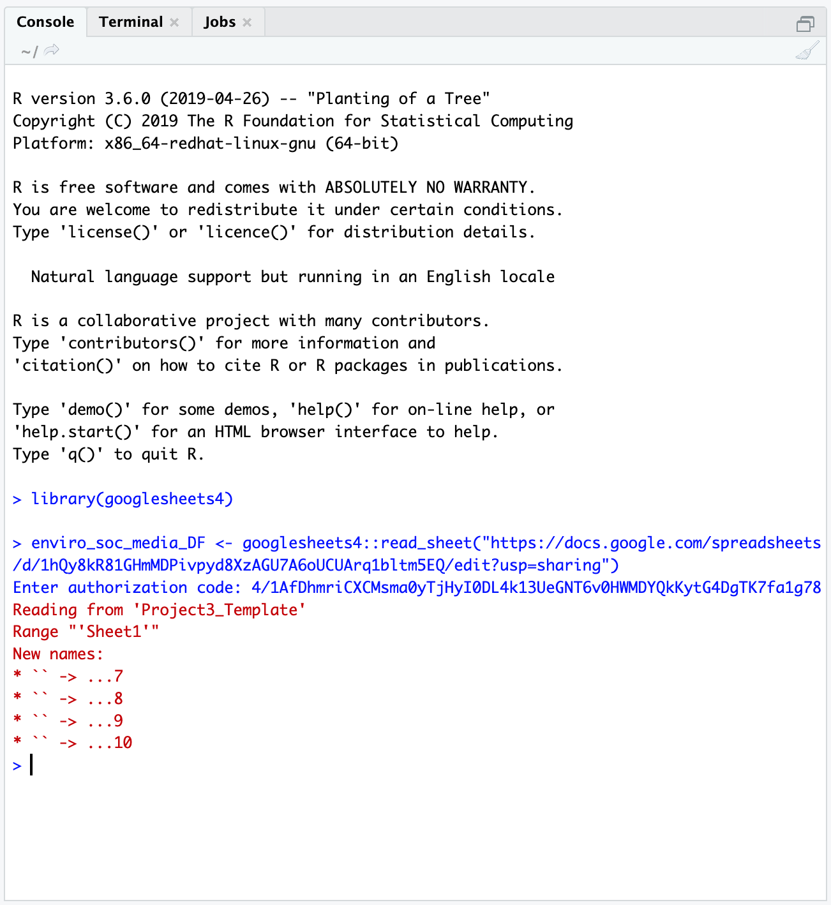

# Week 2 Lab Overview

## Objectives

In lab this week, we will perform the following:

* collect data from PL Air sensors along transects;
* revisit and enhance community guidelines to also incorporate field safety;
* develop questions as PL Air groups to explore.

Time permitting, we may also take on the following tasks:

* viewing and interacting the PL Air data from week 1 in `R` using RStudio Server.

## Designing environmental data collection

One ubiquitous method of field sampling is the transect sampling method. For transect sampling, one typically takes data at specific, equally-spaced locations along a gradient or across (micro)habitats. For one example of transect sampling air pollution, please see this [Public Lab write up](https://publiclab.org/notes/sarasage/08-09-2021/choosing-locations-and-methodology-for-air-quality-gas-testing) and/or this [Inside Ecology write up](https://insideecology.com/2018/09/11/the-ecology-of-air-pollution/). This is also a form of systematic sampling, as you would be taking measurements at locations based on a fixed pattern. For more background on sampling procedures and guidance on one way to think through sampling design, please visit this [Environmental Chemical Analysis site](https://web.njit.edu/~kebbekus/analysis/SAMPLING.htm). Note that not all of the examples there are relevant (e.g. biodiversity sampling, soil sampling), but the general principles in Sections 2.1, 2.2 (our sample is more akin to a "grab sample"), and 2.4 are pertinent.

# Lab steps

## Taking data with your PL Air teams

* Note that you can always see who is in your group by navigating to the [Roster sub-page](https://sakai.claremont.edu/portal/directtool/53e2629b-e3ca-49ab-bf71-4b5a9f4e535a/) on Sakai then going to **Group** and selecting your group's name.
* With your groups, you will select an initial location to test out running a transect with your PL Air units.
    + I strongly recommend bringing a notebook and having one member of the team act as a timer. The timer (or another member) can also keep track of your distance between points. Questions to consider include: How far apart should your points be? How long should you collect data at each location?
* Here is a list of suggested locations. Quyên and I will circulate among the groups.
    + Pomona College Organic Farm / 1st street
    + Marston Quad and College Avenue
    + Foothill Avenue and College Avenue
    + Former gymnasium and active construction site near 6th and Amherst.
* As an initial exercise, we will allocate up to 1 hour collecting data.
    + In that time, I would recommend performing **replicates** of your transects.
    + I would recommend taking data at stationary *points* at different *distances* for instance to your site of interest. (Consider how the different sites could vary in terms of air quality.)
* The mobile application `Google Earth` can be used to determine your distance to a point of interest.

## Enhancing the community guidelines document

Before we revisit the community guidelines document, please read this article in [Small Pond Science](https://smallpondscience.com/2017/07/10/safety-in-the-field/) (content warning: references sexual assault) and this [Bulletin of the Ecological Society of America](https://esajournals.onlinelibrary.wiley.com/doi/full/10.1890/0012-9623-95.3.264) article (please pay special attention to Table 1).

Here are some guiding questions to consider. There are additional questions that we can and should consider as a group! Please share them, and if you are uncomfortable sharing them directly, you are welcome to anonymously pose the question in the Google doc.

* When and where does working in teams or small groups enhance field safety? When might working in teams or small groups be less than ideal for safety?
* What are the signs of physical or emotional distress? How can we support and look out for one another?
* When and where can technology facilitate safety? When and where might technology undermine field safety?
* What are examples of conditions that are unsafe in the field? How can we avoid them? How can we look out for one another with respect to avoiding these conditions or dealing with these conditions constructively?
    + One example could be contact with a [poisonous plant such as poison oak](https://www.cdc.gov/niosh/topics/plants/symptoms.html).
    + Another could be a confrontation with another person, which could be driven by larger systemic biases.
    + Finally, conditions such as uneven terrain or very open locations with no tree cover could pose issues in this time of year (or in general).
* What are best practices for communicating our comfort or discomfort in the field?
* What might be different physical, emotional, or other barriers to participating in different forms of field work or field work in different types of locations?

## Developing your group project

For this laboratory project, you will have several decisions to make:

* What question do we seek to explore with PL Air data? What variable(s) are we particularly interested in? 
* What is an appropriate distance between sampling points?
* What, if any, sources or locations do we seek to sample?
* How long should we remain at each point to collect the data?
* How many replicates should we take of our data? In this context, replicates could mean the combination of *distance to a location/source*, *time duration*, and *variable measured* if these are variables of interest to your group.

This resource from the [Royal Geographical Society](https://www.rgs.org/schools/teaching-resources/sampling-techniques/) may provide additional insight into designing your transects.

### A note on replicating data

How might you replicate data collection to try and account for uncertainty in individual estimates? Generally there are two broad ways to achieve this: spatial replication and temporal replication. In working with your groups, please discuss the salient variables that could affect your question (e.g. distance to a road or a construction site for pollutants, tree cover for a heat island effect, and time of day). You can then develop a plan to collect data.

### Additional air pollution information

Note that the PL Air units report AQI, PM 2.5, PM 10, and O3 data. You can toggle back to the previous week's Air Quality page to see Myriad Sensors' (PL Air company) description of how these values are estimated. However, if, for instance, you are interested in the raw values of PM 2.5 that are reported, you may wonder how these values are converted to and from AQI scores. You can navigate to [this AirNow calculator](https://www.airnow.gov/aqi/aqi-calculator-concentration/) to see how your data maps to AQI. If you would like to see the interpretation of AQI values, please check out [this AirNow explainer site](https://www.airnow.gov/aqi/aqi-basics/). Note - researchers are still developing ways to take the much more instantaneous data we observe on the PL Air and other sensors to "instant exposure" AQI scales. For now though we can use the 24-hour averages for PM and submit the observed data to see that mapping play out (between $\mu g/m^3$ to AQI scores).

# Analyzing PocketLab Air data

This component of the laboratory may be pushed to a later date if time does not permit in lab.

## Authorizing access to Google sheets with the `googlesheets4` package in `R`

Note that the code here **only needs to be run ONCE**. Once you have installed a package, you do not need to re-install it.

I recommend running these lines of code in the `Console` which always has the `>` symbol to take in a command).

```{r, eval=FALSE}
install.packages("googlesheets4")
```

You will see something like this - don't be alarmed by the red text!

```{r, echo=FALSE, out.height="780px"}
knitr::include_graphics("figures/installationgunk.png")
```

# Setting up the `Googlesheets4` package

This workflow also only needs to be done **ONCE**. The first time you interact with a Google sheet using the `googlesheets4` Application Programming Interface (API) wrapper, it will ask you about permissions to store your credentials (account information). You can run these commands in the console.

The workflow is below:

1. Read in an example Google sheet, which will launch an initial query about what Google account you'd like to associate with the package:

```{r, eval=FALSE}
enviro_soc_media_DF <- googlesheets4::read_sheet("https://docs.google.com/spreadsheets/d/1hQy8kR81GHmMDPivpyd8XzAGU7A6oUCUArq1bltm5EQ/edit?usp=sharing")
```

2. At the same time, another tab will open in your internet browser on your computer, displaying a window that asks you to select which of your Google account(s) to grant access to in `RStudio Server` using the `googlesheets4` package.

```{r, echo=FALSE}
knitr::include_graphics("figures/grantTidyverse.png")
```

3. Select `Allow`. Next, you will see:

```{r, echo=FALSE, out.height="700px"}
knitr::include_graphics("figures/permissions.png")
```

4. Select `Allow` again. This will produce an authorization code that you will then copy and paste into your `RStudio` session. You can copy the code by pressing the `r fontawesome::fa("copy")` button to the right of the authentication code.

```{r, echo=FALSE}
knitr::include_graphics("figures/RStudioOAuthCopyCode.png")
```

5. Next, navigate back to the internet browser tab running `RStudio Server`. You will paste the code in response to the `Enter authorization code` prompt waiting in the console.

```{r, echo=FALSE}
knitr::include_graphics("figures/RStudioServerInitAuth.png")
```

6. Copy the authorization code into the blank space next to `Enter authorization code`.

7. Once you paste the code in, you will see this type of successful response, showing you that the authentication has worked and the `read_sheet` function `googlesheets4` will return:

```{r, echo=FALSE}

```

8. Great work! You have successfully authenticated access to your Google account in your `RStudio Server` user workspace.

9. Going forward, even if you switch sessions, restart your session, or open a new session in `RStudio Server`, you shouldn't need to re-authenticate access to Google. Instead, your credentials will be stored in a cached file. It may ask you though if you want to use a particular "credential" (basically an account) - usually you would type `1` for the first account listed.

## Interacting with PocketLab Air data as a Google sheet

### Android data

```{r PLair_Android, eval=F}
library(googlesheets4)
library(dplyr)

### Here we are pulling in the Google Sheets data from team Paprika
airDF <- googlesheets4::read_sheet("https://docs.google.com/spreadsheets/d/14l_xiqddGl2IFpOPsjfCSSLaHLVeunBhsToimXFuPrA/edit?usp=sharing") # here, we're saying - go to this URL, pull in the Googlesheet, then store it in an object called airDF

### We can see what our data looks like by calling airDF in the console
airDF # yay!

### If we wanted to see what the average PM value was across the trial, we could, for instance, run
mean(airDF$`Particulate Matter-PM2.5 (ug/m&#179;)`)

### We can also see more information about the variable - min, max, and some quartiles.
summary(airDF$`Particulate Matter-PM2.5 (ug/m&#179;)`)

### We can repeat this for the more smoothed-out values of the 10-minute averaged PM 2.5 data
mean(airDF$`Particulate Matter-10 Min. Avg. PM2.5 (ug/m&#179;)`)
summary(airDF$`Particulate Matter-10 Min. Avg. PM2.5 (ug/m&#179;)`)
```


### iOS data

One issue with the `iOS` data is that the mobile application splinches the spreadsheet data. Typically, we would expect to see all of the data in a tidy set of columns, where each row is a particular time point. However, the `iOS` PocketLab application basically creates a new mini-spreadsheet for each sensor.

Below are the URLs for all of the `iOS` groups.

* Fresno: "https://docs.google.com/spreadsheets/d/15l8zplAYiLu6kmqPqo0kExe5Ww3RPeSTMlkfv2XoMDc/edit?usp=sharing"
* Aji: "https://docs.google.com/spreadsheets/d/1Q9sm9IokCP0lba-ZcBGXG2YkkSOyhRSw-4ijbs1HU-s/edit?usp=sharing"
* Shishito: "https://docs.google.com/spreadsheets/d/17KYbZqLEirxh2cAr6dOlIBJhKo5LWPuvq3dgDPZ-NHA/edit?usp=sharing"
* Bird's Eye: "https://docs.google.com/spreadsheets/d/1QX5ESRLnq3hjeWAPinquTvK9RELK0cMvIEAjBxhG_6Q/edit?usp=sharing"

```{r PLair, eval=F}
library(googlesheets4)
library(dplyr)

### Here, we are pulling in Google Sheets data from team Scorpion
airDF <- googlesheets4::read_sheet("https://docs.google.com/spreadsheets/d/1gn6A3uht6e9iQ3qCmqGUTFRhP6YZLdejt5yYjhzeQks/edit?usp=sharing")

### What happens when we type airDF in the console?
airDF # cool! We see a subset of our data displayed

### Now we are going to start the clean up process
### Note that when R pulled in the data, it came
### as this rather unpleasant "list" structure.
my_unlisting_function <- function(j) { # function to get R's unlisting to work
  sapply(j, function(x) ifelse(is.null(x),NA,x)) # if there is "no data" in a row, replace it with NA
}
  # Now we are going to use several cool "Tidyverse" features
  # to automagically convert all of the columns from list to vectors
airDF <- airDF %>% 
  mutate( across( where(is.list), my_unlisting_function)) # we're applying this function (my_unlisting function) to each column that is a list (which is each column)

### Storing the row locations that have added-on data
indices <- which(airDF$Lat=="Lat") # we're using the fact that every time PocketLab
   # adds on another variable from the sensor, it tacks on "Lat" at the start of the row.

### We are going to instantiate a clean data table and build from there
airCleanDF <- airDF[1:(indices[1]-2),c(1:8)]

### Now we are going to create a set of individual data tables
### to store our data more cleanly.
### The for loop below is going to "walk" through each value of the indices object
### and it is going to use the row values in indices to extract the sensor data we
### want and tack it on as added columns to our clean airCleanDF data table.
var_name <- c()
for (i in c(1:length(indices))) {
  #print(i)
  index_start <- indices[i]+1
  if (i==1) {
    index_end <- indices[(i+1)]-2
    var_name <- append(var_name, c(airDF[indices[i],5],airDF[indices[i],6]), after=length(var_name))
    airCleanDF[,9] <- airDF[index_start:index_end,5]
    airCleanDF[,10] <- airDF[index_start:index_end,6]
  } else if (i==2) {
    index_end <- indices[(i+1)]-2
    var_name <- append(var_name, c(airDF[indices[i],5],airDF[indices[i],6]), after=length(var_name))
    airCleanDF[,11] <- airDF[index_start:index_end,5]
    airCleanDF[,12] <- airDF[index_start:index_end,6]
  } else if (i==3) {
    index_end <- indices[(i+1)]-2
    var_name <- append(var_name, c(airDF[indices[i],5],airDF[indices[i],6],airDF[indices[i],7],
                                   airDF[indices[i],8],airDF[indices[i],9],airDF[indices[i],10],
                                   airDF[indices[i],11]), after=length(var_name))
    airCleanDF[,13] <- airDF[index_start:index_end,5]
    airCleanDF[,14] <- airDF[index_start:index_end,6]
    airCleanDF[,15] <- airDF[index_start:index_end,7]
    airCleanDF[,16] <- airDF[index_start:index_end,8]
    airCleanDF[,17] <- airDF[index_start:index_end,9]
    airCleanDF[,18] <- airDF[index_start:index_end,10]
    airCleanDF[,19] <- airDF[index_start:index_end,11]
  } else if (i==4) {
    index_end <- indices[(i+1)]-2
    var_name <- append(var_name, c(airDF[indices[i],9],airDF[indices[i],10]), after=length(var_name))
    airCleanDF[,20] <- airDF[index_start:index_end,9]
    airCleanDF[,21] <- airDF[index_start:index_end,10]
  }
}

### Cleaning up our airCleanDF data table
names(airCleanDF)[9:21] <- unlist(var_name) # we are going to give our tacked-on columns more informative names

### Viewing our clean data
airCleanDF %>%
  head()  %>% # view first 6 rows
    View() # pop up an Excel-like data viewer.
```

Now that we finally have clean data (yay!) we can calculate the same types of summary statistics.

```{r clean_ios_data, eval=F}
### Calculating the mean and summary statistics for PM data
mean(airCleanDF$`PM2.5 (µg/m³)`)
summary(airCleanDF$`PM2.5 (µg/m³)`) # note that the variable names are a bit different from the Android ones

### We can also repeat this for the smoother averaged values
mean(airCleanDF$`Mean PM2.5 (µg/m³)`)
summary(airCleanDF$`Mean PM2.5 (µg/m³)`)
```

    
