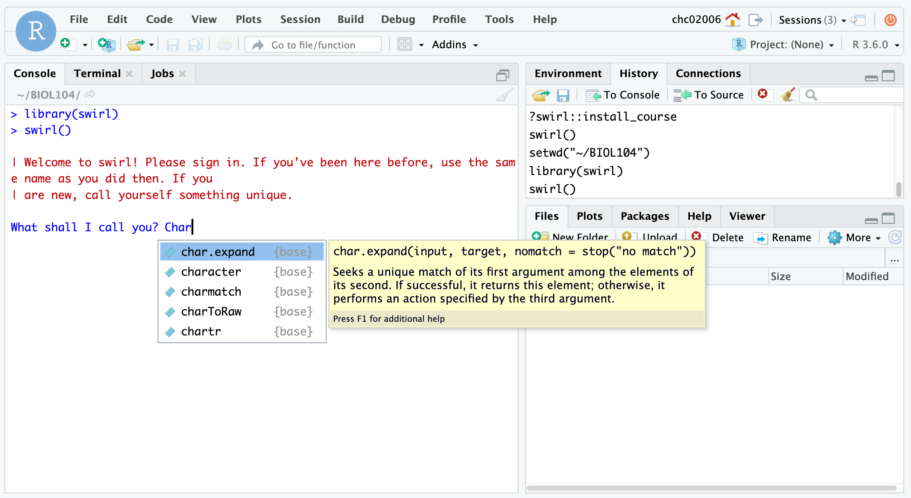

## Getting started with data in `R`

Key concepts that you will learn:

* What is `R`?
* What is RStudio?
* How do I code in `R`?

## What are `R` and RStudio?

In this class, we will take a cookbook approach to environmental data science.What does a "cookbook approach" mean in this context? In this course, I do not assume that you have prior programming experience and instead I will provide worksheets and worked-through example code that you then execute and learn by doing (or code running). Where appropriate, I will also use *faded examples* to advance learning in a structured and scaffolded way ([see Section 7 in Wilson 2019](https://journals.plos.org/ploscompbiol/article?id=10.1371/journal.pcbi.1006915#sec008) for more details if you are curious).

Specifically, you will interact with `R`, a statistical programming language, using RStudio. RStudio is an "IDE" or an integrated development environment. Basically, if `R` is the engine of our (statistical programming) car, then RStudio is our dashboard, with all of the controls that we'd be more familiar with (plotting window, file visualization pane, help pane, etc.).


## How do I access RStudio?

**Note: ITS is currently migrating RStudio Server to a new environment. I will update these instructions once the migration is complete.**

You will navigate to [https://rstudio.pomona.edu](https://rstudio.pomona.edu) and use your Pomona credentials to log in. Pomona students: please use your existing user ID. Non-Pomona students: if you do not already have a Pomona account, please email [helpdesk@pomona.edu](mailto:helpdesk@pomona.edu?subject=EA30%20PO%20Student%20RStudio%20Access) and cc me (`chchang@pomona.edu`) or use the chat feature at [http://its.pomona.edu](http://its.pomona.edu) to request an account. ITS will "require that a student provides proof of their identity by sending us a photo of themselves holding their 7C ID card (since they can't come in person to the Service Desk right now)."

## What does RStudio have anyway?

RStudio has 3 different panes:


## What do each of these panes do?

* Console: where you enter commands that `R` interprets
    + Running code: the act of telling `R` to perform an act by giving it commands in the console.
* Environment: lists all objects/data/functions available to you in the current session
    + Session: the current instance that you have logged into RStudio (NB: unlike other software, the session doesn't necessarily end when you close the browser window! Instead, it can preserve its state over time).
* Output: later on, we will interact with this pane most often to display plots that you generate!
    + The other tabs in this pane can be used to navigate through files, see available packages that extend the functionality of `R`, view help, and view spreadsheets (`Viewer`).

## Running your first `R` code!

Copy the code below into the console and hit enter. What do you see?

```{r, eval=FALSE}
x <- c(1,2,3)
x
```

You should see the following:

```{r, echo=FALSE}
x <- c(1,2,3)
x
```

Congratulations! You have created your first object in `R`: a vector storing the numbers 1, 2, and 3.

You achieved that by using the assignment operator `<-` to tell `R` to create a new object, `x`, that stores the values 1, 2, and 3 in a vector, denoted by `c(...)` where the `...` is just a placeholder for whatever you'd like to enter (where each element is separated by commas).

# Learning more about `R` with `swirl`

We will use the package `swirl` to learn more about several fundamental concepts in `R`.
 
## Steps

1. Log-in at [https://rstudio.pomona.edu](https://rstudio.pomona.edu)
2. In the console, type in `library(swirl)`
    + All subsequent steps should be run in the console.
3. Type in `swirl()`
4. You will see a message in red text, reading `| Welcome to swirl!...call yourself something unique.`
    + In the line below, you will see a prompt in blue asking `What shall I call you?`
    + Please type in your first name or nickname.
    + Note that if your name overlaps with commands in `R`, you may see functions popping up in auto-complete.
    + The image below shows this exact problem for my nickname, `Char`.
    + Type out your name and use the back-arrow to avoid auto-selecting a function or some other command if it does pop up as an auto-complete field. (This is--hopefully--very unlikely to happen!)



5. After you type in your name, you will see this message in red text. Basically, the gist of the message is that `swirl` will interact with you in the console, and any time you see three blue dots (an ellipsis), you should hit enter.
```
| Thanks, <FIRST NAME>. Let's cover a couple of quick housekeeping items...
```

6. Continue through the next two `swirl` steps, which lead to this query in red text: `| Please choose a course, or type 0 to exit swirl`
    + NB (Nota bene): By this point, `swirl` has mentioned the `R prompt (>)` several times.
    + The character `>` is an example of a **command prompt** where you tell a computer (in this case, the server hosting RStudio Server which is running `R` code) to execute your command.
    + *Examples from other languages*: In Python, the command prompt is denoted by `>>>` (if you are interacting with Python on the command line in a terminal). In Unix operating systems (e.g. Linux distributions or Mac OS), the command prompt for the terminal is often denoted by `$`.
    + TL;DR: The carat symbol `>` in the `R` console within RStudio Server is where `R` awaits your instructions (commands).
7. In response to the query (`| Please choose a course...`), type `1` after the blue text reading `Selection:`
8. In response to the next query, `| Please choose a lesson...`, please type `1` after the blue text reading `Selection:`.
    + We will be taking on the `1: Basic Building Blocks` lesson!
9. You are ready to go and learn about fundamental programming concepts in `R` using this first class in `swirl`.
10. If you encounter errors, don't worry! Just try something different and think a bit more carefully about the `swirl` instructions at that step. You can always use the vertical navigation bar on the right-hand side of the console to roll back up and see what the last instruction was. 
For example, in response to this instruction:
```
| To see another example of how this vector 'recycling' works, try
| adding c(1, 2, 3, 4) and c(0, 10). Don't worry about saving the
| result in a new variable.
```
my command here was incorrectly specified (typed in at the `R` command prompt `>`):
```
c(1, 2, 3, 4) _ c(0, 10)
```
and threw an error:
```
Error: unexpected input in "c(1, 2, 3, 4) _"
```
In this case, I ended up fixing it by typing:
```
c(1, 2, 3, 4) + c(0, 10)
```

Unfortunately, with these types of *syntax* errors (akin to a grammatical error in a human language, like kluging your verb conjugation and forgetting the term for a conjunction to join two clauses together), `swirl` won't jump in and "automagically" help you. 

If you get really stuck, first try entering something that is syntatically correct in the console at the command prompt. For instance, you could try `myName <- "Char"`. While this isn't the correct answer to this `swirl` instruction, because this command can be interpreted by `R`, you'll get kicked back into `swirl` instructions that may offer you something that you could directly copy and paste into the console, e.g.:
```
| That's not exactly what I'm looking for. Try again. Or, type info()
| for more options.

| Type c(1, 2, 3, 4) + c(0, 10, 100) to see how R handles adding two
| vectors, when the shorter vector's length does not divide evenly
| into the longer vector's length. Don't worry about assigning the
| result to a variable.
```
(Note that here you would type or copy and paste `c(1, 2, 3, 4) + c(0, 10, 100)` into the console at the command prompt `>`.)

11. If you are in the middle of interacting with the command prompt (`>`), you can exit the course and `swirl` at any time by typing `bye()` into the console.
    + Don't worry: `swirl` will save where you are in the course so you won't lose your progress!
12. The course tracks your progress: when you see the black text displaying `|=========`, the number at the right hand side, after another `|` represents the percentage of this course that you have completed.
13. At the end of the course, you will see a question from `swirl` asking:
```
| Would you like to receive credit for completing this course on
| Coursera.org?
```
I recommend typing in `2` (representing "No") at the `Selection:` field.

14. Afterwards, `swirl` will tell you that you've completed the course, you will see the following in red text:
```
| Excellent work!
| You've reached the end of this lesson...
| Please choose a course, or type 0 to exit swirl.
```
In response to the blue `Selection:` query, please type 0.

15. When you have completed the first `swirl` course, please navigate to the [Gradescope POM](https://www.gradescope.com/courses/298727/assignments/1438680) subpage in our Sakai site and select the correct option for the `Completion of swirl class (Basic Building Blocks)` assignment.

**If you have been working on this swirl class for an amount of time that feels really excessive (e.g. > 2 hours), please don't keep on hitting your head against the wall.** Reach out to me on the class Slack channel.